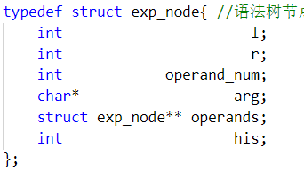
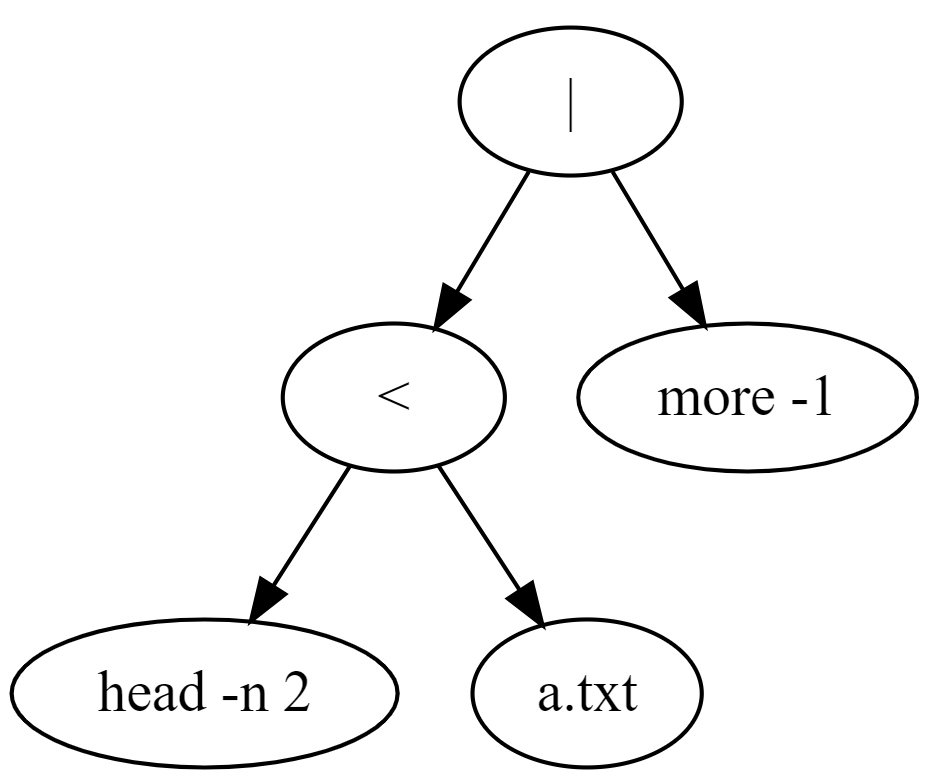
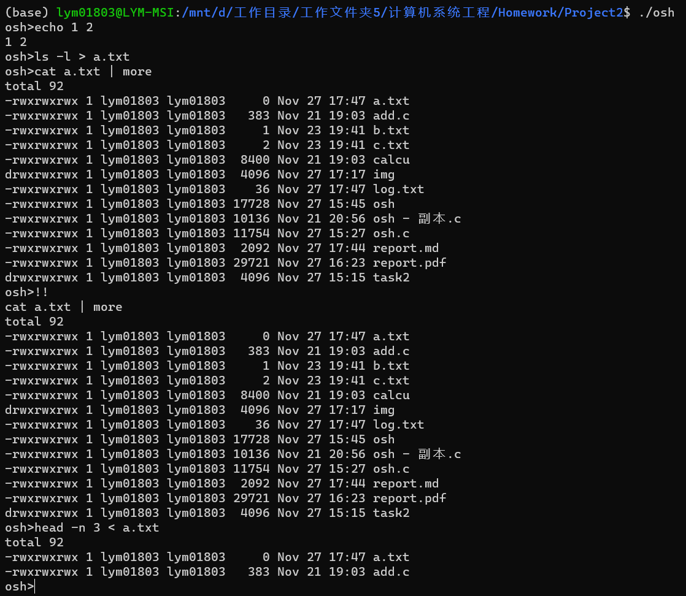
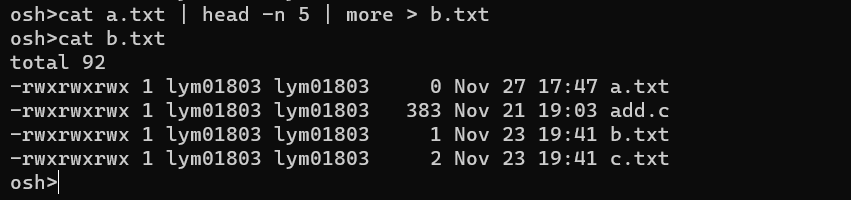
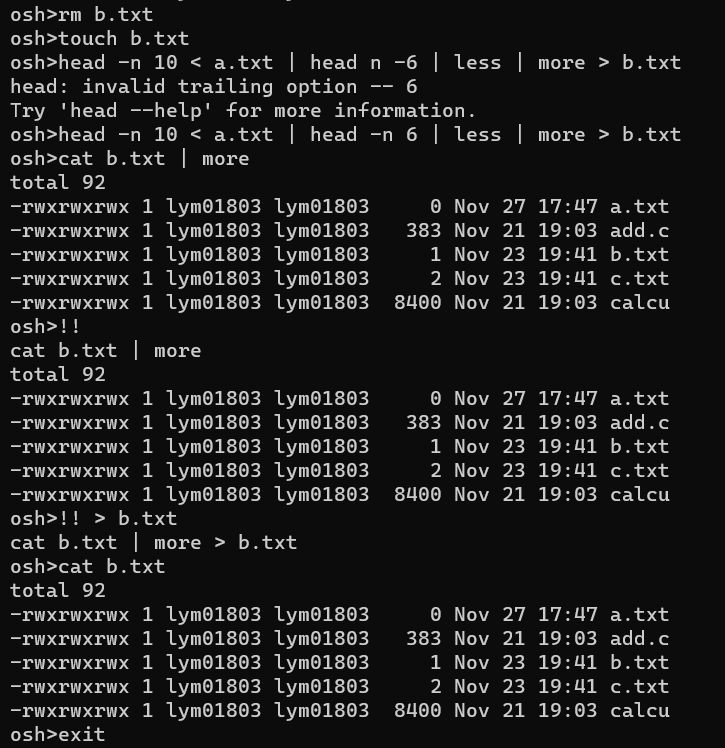

# Report for Project 2

## Task 1: UNIX Shell

### Description

Design a C program to serve as a shell interface that accepts user commands and then executes each command in a separate process. Should support:

- Creating the child process and executing the command in the child
- Providing a history feature
- Input and output redirection
- Allowing the parent and child processes to communicate via a pipe

### Implement
#### [The Source Code](https://github.com/lym01803/EI338-OS-Project2-Toy-Shell.git)
#### Some Simplifies
Parsing the command is a complicated work. To make it easier, I assume that :

1. There are no brackets and quotations; 
2. All the arguments and symbols are split by space (one or more);
3. Only support symbols: ```!! , | , < , > , & ,```
    and assume they have the same priority;
4. Other necessary simplifies: for example, assume that no command like ``` > a.txt echo 1 ``` (the command ```echo 1  > a.txt``` is ok).

#### Toy Syntax Tree
**Node:**



Recoding the symbol, arguments' position and child nodes.

**Tree:**

For example:

```bash
head -n 2 < a.txt | more -1
```



#### Execute

Call the function 
```c
int execvp(const char * file, char * const argv []);
```

For example:

To execute 
```bash
ls -l
```
we call
```c
execvp("ls", {"ls", "-l", NULL});
```

#### Redirection

Use the function
```c
int dup2(int oldfd, int newfd);
```

For example:

To output to ```a.txt``` instead of ```stdout```, we call
```c
fout = open("a.txt", O_RDWR|O_CREAT, 0644);
dup2(fout, STDOUT_FILENO);
```

#### Pipe

Use the function
```c
int pipe(int filedes[2]);
```
```filedes[0]``` is the write pointer and ```filedes[1]``` is the read pointer.


#### Process:
1. Read the next command.
2. Split the command into arguments.
3. Parse the arguments to get the syntax tree.
4. Execute the expression according to the syntax tree.

### Test The Shell
Test redirection and communicating via pipe. And test support for history.



Try some more complex commands. Although it is just a toy shell which is not designed to parse complex commands, I am curious about whether it works when the command contains multiple pipes and redirections.



Try more commands including some mistakes to check the robustness of this toy shell.



